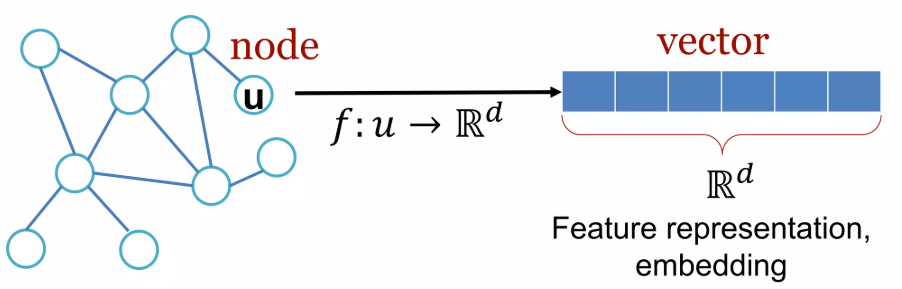

# Calculate the Laplacian
With b-splines, we can get the Laplacian immediately. 
spline = BSpline(t, c, degree, extrapolate=False)
basis[:, i] = spline(x)
d2basis[:, i] = spline.derivative(2)(x). 

We simply decide the size of the grid, and the order of the splines. 
The idea is that it's customizable and adaptable for the user. Hence, the user should be able to choose any kind of grid geometry and any kind of order.
The d2basis will be equal to the weights in the following summation:
> ```math
> \psi''_k(x_i) = \sum_{j=1}^{N} W_{i,j}^{(2)} \psi_k(x_j), \quad \text{for } i = 1, 2, \dots, N; \, k = 1, 2, \dots, N
> ```

this is a direct consequence of: 

\[
D^r B_d(x)^T =
\frac{d!}{(d-r)!} B_{d-r}(x)^T D R_{d-r+1} \cdots D R_d.
\]


# Why graphs?
gaphs are a generla language and anlaying entities with relationsa dn interaction. so rather than thinking of th world or a giving fomanin as a set of isolated datapoints,we think of it in terms of networks and relations between these entiities.
This means that we have an undelrying grpah of relations between entities
Modelling the the relational structure of the underlying domain, allows us to build more faitful, accurate models of the underlying phenomena/data.
Networks of particle in physics for example can be represented as graphs. 
The domain is inerently a graph. 
3D shapes is another thing. 
in accelerator physics, we deal with both 3D-shapes (if we discertize the domain) but also, teh particles themselves and their connections using graphs. (however, this owuld be very computaional inepxensive...)

How do we take advanatge of this relational structure rto make more accuarte predictions.

Todays deep-learning model tolbox are specialized ofr simple sequences and grids. amazing tools to develop to analyze ths simple structure. 
Fixed size grids and fix sizd tesnors. 
Graph  arre harder to process. arbitrary size and ocmpelx topology, there is no spatlia locailty ( text left and right, grid up and down eleft and right). graphs no notion of spatial locality. tehre is no fixed node ordering. Often these networks are dynamic and have multimodel fetaure.s 

How do we develop neual networks that are much more broadly applicable.

# input 
Input will be grpahs. 
A lot of effort goes into designing proper fetaures. so ML model can take adavnatge of it. 
representation leanring, teh fetaure iegnieeirng step is taken away. Automaticlaly learnign feature in the graph (represetation leanring) 
D dimensional embedidngs (vectors), 
Map nodes in a grpah to a D-dimensional vector or embedding, such that similar nodes in the network are embedded close together




# Dataset 
- Construct data setstochastic gradient descent, after shuffling
# Model
Every Model that you build in Pytoch inherit from nn.model, which is a superclass for every model. 
Makes an easy interface to optimize and run. 
This model has two function. 
- Initilization (defines all the paraameters you use)
- Forwards ( It tells you how to construct teh ocmputation graph form inpt to output)


# GNN PyTorch Concepts

## Introduction
This repository explores concepts related to Graph Neural Networks (GNNs) implemented in PyTorch. It covers fundamental principles, architectural components, and practical examples for building and training GNN models.


## Features
- Implementation of various GNN architectures using PyTorch and PyTorch Geometric.
- Explanation of key concepts such as message passing, node embeddings, and graph convolutions.
- Examples showcasing applications of GNNs in different domains.
- Step-by-step tutorials for building custom GNN models.

## Installation
To set up the environment and install dependencies, run:

```bash
pip install torch torchvision torchaudio torch-geometric
